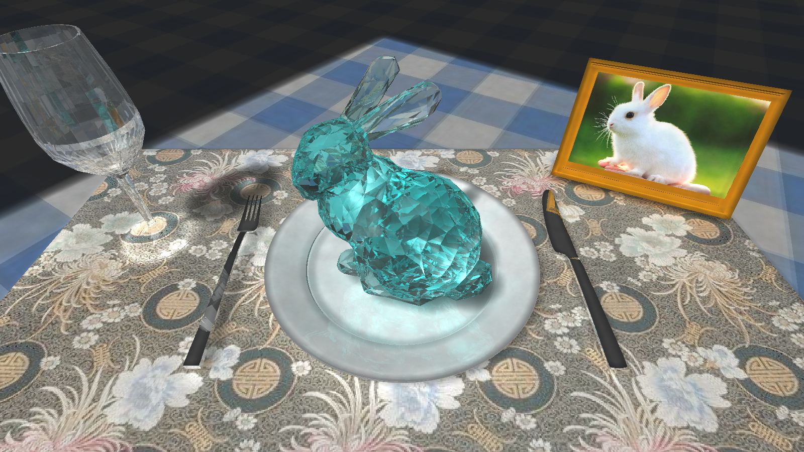

# Computer Graphics Final Project
## Ray Tracing through Photon Mapping

**Figure:** *One example rendered by photon mapping. A finite large rectangular directed light source is used for illumination, and a total of 4000000 photons are released. The maximum iteration depth is 20. One can clearly see the reflection of the knife, the glass, the glow of the bottom of the glass and the soft shadows formed by the sampling of the surface light source.*

This is the repository for 2020 Fall computer graphics course project, which implements a ray tracing engine based on photon mapping, supporting depth of field, soft shadow and texture mapping. At the same time, OpenMP is used for CPU parallel acceleration, hierarchical bounding box and K-D tree are used for complex mesh intersection acceleration, and K-D tree is also used for photon graph collision point search acceleration. See final report [there(in Chinese)](./Final/FinalReport.pdf).
